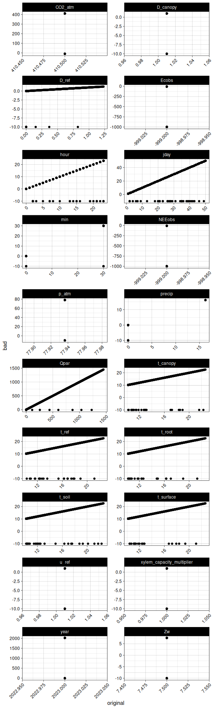
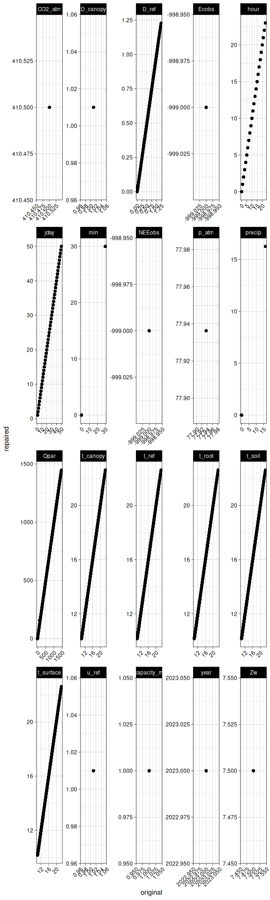
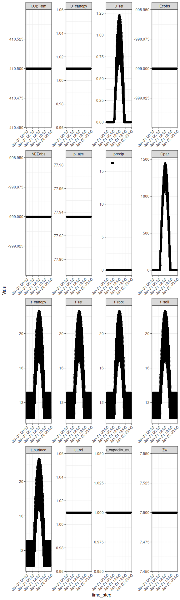
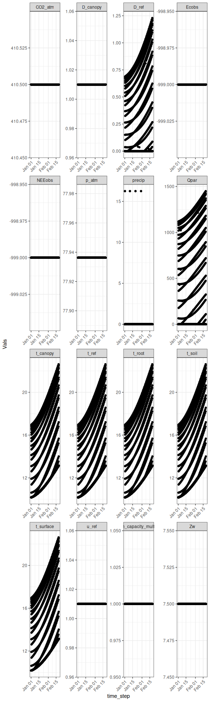
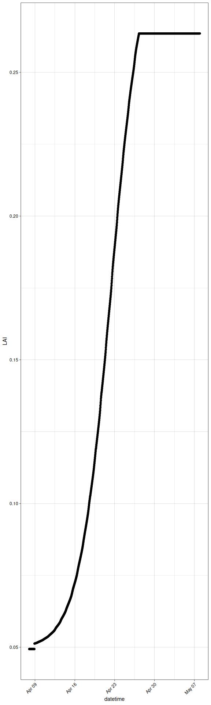
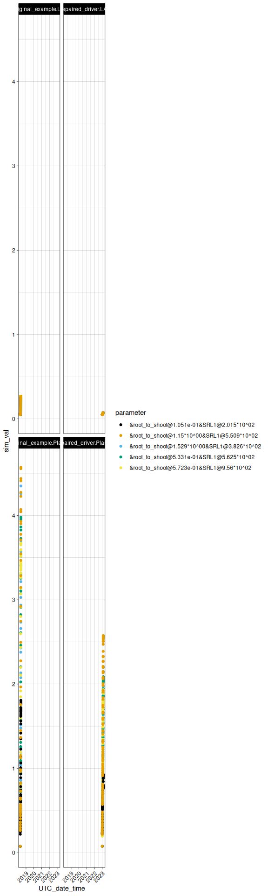

rTREES
================
Mitchell C. Hitchcock
2025-03-04

This page tests and demonstrates the rTREES package for running the
Terrestrial Regional Ecosystem Exchange Simulator in R. See the
description file for sources and requirements.

# Install the package

If the rTREES .tar.gz file is in the same working directory as this file
the following code will work as is. Otherwise, fill in the full path to
the file.

``` r
# install.packages("rTREES_2025.03.02.tar.gz",repos = NULL, type = "source", dependencies = TRUE)
# install.packages("~/fullpath/rTREES_2025.03.02.tar.gz",repos = NULL, type = "source", dependencies = TRUE)
```

``` r
library(rTREES)
library(tidyverse)
```

    ## ── Attaching core tidyverse packages ──────────────────────── tidyverse 2.0.0 ──
    ## ✔ dplyr     1.1.4     ✔ readr     2.1.5
    ## ✔ forcats   1.0.0     ✔ stringr   1.5.1
    ## ✔ ggplot2   3.5.1     ✔ tibble    3.2.1
    ## ✔ lubridate 1.9.4     ✔ tidyr     1.3.1
    ## ✔ purrr     1.0.4     
    ## ── Conflicts ────────────────────────────────────────── tidyverse_conflicts() ──
    ## ✖ dplyr::filter() masks stats::filter()
    ## ✖ dplyr::lag()    masks stats::lag()
    ## ℹ Use the conflicted package (<http://conflicted.r-lib.org/>) to force all conflicts to become errors

``` r
library(ggthemes)
options(scipen=5,rstudio.notebook.executing=TRUE)
knitr::opts_chunk$set(
  collapse = TRUE,
  comment = "#>",
  fig.width = 6,
  fig.height = 20,
  out.width = "90%",
  eval.after = c("fig.height", "fig.width")
)
```

# Setup

## Load inputs from file

``` r
demo_inputs_from_file<-Load_TREES_files(
driver=system.file("examples","demo_driver.txt",package="rTREES"),
parameters = system.file("examples","demo_parameter.p",package="rTREES"),
root_shoot_soil = system.file("examples","demo_root_shoot_soil",package="rTREES")
)
#> Driver validation complete, 0 possible issues identified.
#> Warning in ValidateParameters(parameters):
#> Parameter validation complete, 0 possible issues identified.
#> Root-Shoot-Soil layer parameters loaded.
```

## Generate boilerplate inputs

### Environemental driver

``` r
demo_driver<-BuildDriver(
  lat = 35.818,
  long = -106.305,
  alt = 2150.0,
  ndays = 50,
  year = 2023,
  start_jday=1,
  dewpoint = 12,
  co2_atm=410.5,
  wind_speed=1.01,
  precipdays = c(1, 10, 20,30),
  precip_amount = 16.25,
  temp_scalar=1
)
knitr::kable(demo_driver[1:10,], format = "markdown")
```

| year | jday | hour | min | u_ref | t_ref | D_ref | precip | Qpar | t_canopy | D_canopy | p_atm | CO2_atm | t_surface | t_soil | t_root | Zw | xylem_capacity_multiplier | NEEobs | Ecobs |
|---:|---:|---:|---:|---:|---:|---:|---:|---:|---:|---:|---:|---:|---:|---:|---:|---:|---:|---:|---:|
| 2023 | 1 | 0 | 0 | 1.01 | 10.17776 | 0 | 0 | 0 | 10.17776 | 1.01 | 77.93626 | 410.5 | 10.17776 | 10.17776 | 10.17776 | 7.5 | 1 | -999 | -999 |
| 2023 | 1 | 0 | 30 | 1.01 | 10.17776 | 0 | 0 | 0 | 10.17776 | 1.01 | 77.93626 | 410.5 | 10.17776 | 10.17776 | 10.17776 | 7.5 | 1 | -999 | -999 |
| 2023 | 1 | 1 | 0 | 1.01 | 10.17776 | 0 | 0 | 0 | 10.17776 | 1.01 | 77.93626 | 410.5 | 10.17776 | 10.17776 | 10.17776 | 7.5 | 1 | -999 | -999 |
| 2023 | 1 | 1 | 30 | 1.01 | 10.17776 | 0 | 0 | 0 | 10.17776 | 1.01 | 77.93626 | 410.5 | 10.17776 | 10.17776 | 10.17776 | 7.5 | 1 | -999 | -999 |
| 2023 | 1 | 2 | 0 | 1.01 | 10.17776 | 0 | 0 | 0 | 10.17776 | 1.01 | 77.93626 | 410.5 | 10.17776 | 10.17776 | 10.17776 | 7.5 | 1 | -999 | -999 |
| 2023 | 1 | 2 | 30 | 1.01 | 10.17776 | 0 | 0 | 0 | 10.17776 | 1.01 | 77.93626 | 410.5 | 10.17776 | 10.17776 | 10.17776 | 7.5 | 1 | -999 | -999 |
| 2023 | 1 | 3 | 0 | 1.01 | 10.17776 | 0 | 0 | 0 | 10.17776 | 1.01 | 77.93626 | 410.5 | 10.17776 | 10.17776 | 10.17776 | 7.5 | 1 | -999 | -999 |
| 2023 | 1 | 3 | 30 | 1.01 | 10.17776 | 0 | 0 | 0 | 10.17776 | 1.01 | 77.93626 | 410.5 | 10.17776 | 10.17776 | 10.17776 | 7.5 | 1 | -999 | -999 |
| 2023 | 1 | 4 | 0 | 1.01 | 10.17776 | 0 | 0 | 0 | 10.17776 | 1.01 | 77.93626 | 410.5 | 10.17776 | 10.17776 | 10.17776 | 7.5 | 1 | -999 | -999 |
| 2023 | 1 | 4 | 30 | 1.01 | 10.17776 | 0 | 0 | 0 | 10.17776 | 1.01 | 77.93626 | 410.5 | 10.17776 | 10.17776 | 10.17776 | 7.5 | 1 | -999 | -999 |

### Main parameters

``` r
demo_parameters<-ExampleParameters()
knitr::kable(demo_parameters, format = "markdown")
```

| Value | Parameter_Name | Notes | Lower_range | Upper_range |
|---:|:---|:---|---:|---:|
| 2.180000e+03 | altitude | <m@Larm> | 0.0000 | 30000.00000 |
| -4.044700e+01 | latitude |  | -90.0000 | 90.00000 |
| -1.052380e+02 | longitude |  | -180.0000 | 180.00000 |
| 4.500000e-01 | z_ref | m | 0.0000 | 1000.00000 |
| 3.000000e-01 | lai | single sided | 0.0500 | 10.00000 |
| 3.000000e-01 | canopy_height | m | 0.0000 | 100.00000 |
| 1.000000e+00 | lai_at_full_canopy_height |  | 0.0500 | 10.00000 |
| 1.000000e+00 | l_angle | spherical may sample | 0.0000 | Inf |
| 9.700000e-01 | canopy | emissivity | 0.8000 | 1.00000 |
| 5.000000e-01 | fPAR_beam | fraction of solar radiation that is PAR | 0.5000 | 0.50000 |
| 5.000000e-01 | fPAR_diff | fraction of solar radiation that is PAR | 0.5000 | 0.50000 |
| 8.000000e-01 | alpha_PAR |  | 0.7000 | 1.00000 |
| 2.000000e-01 | alpha_NIR |  | 0.2000 | 0.20000 |
| 5.000000e-01 | omega |  | 0.4000 | 1.00000 |
| 2.000000e+00 | p_crown |  | 1.0000 | 3.34000 |
| 5.000000e-01 | d_factor | C&Nfig5.5 | 0.0000 | 1.00000 |
| 1.000000e-01 | zm_factor | C&Nfig5.5 | 0.0800 | 1.20000 |
| 2.000000e-01 | zh_factor | 7.19 | 0.2000 | 0.20000 |
| 1.000000e+00 | ps_model | photosynthesis model to use (1 = original C3 2 = experimental C3 3 = C4) | 1.0000 | 3.00000 |
| 2.000000e-02 | Rd_mult | Rd=Rd_mult\*Vcmax | 0.0010 | 0.05000 |
| 2.700000e+00 | Jmax_mult | ratio of Jmax to Vcmax | 1.5000 | 3.00000 |
| 8.000000e-01 | thetaJ | curvature parameter | 0.7000 | 0.90000 |
| 4.000000e-01 | phiJ_sun | quantum yield e-/photon | 0.0000 | 0.50000 |
| 4.000000e-01 | phiJ_shd | quantum yield e-/photon | 0.0000 | 0.50000 |
| 1.815000e-03 | Nleaf |  | 0.0001 | 0.00300 |
| 0.000000e+00 | N_fixed_proportion |  | 0.0000 | 1.00000 |
| 2.000000e-01 | Nrubisco | proportion | 0.1000 | 0.20000 |
| 3.867764e+01 | Kc25 | (Pa) MM const carboxylase 25 deg C | -Inf | Inf |
| 2.100000e+00 | q10Kc | (DIM) Q_10 for kc (default 2.1) | -Inf | Inf |
| 2.612326e+04 | Ko25 | (Pa) MM const oxygenase 25 deg C | -Inf | Inf |
| 1.200000e+00 | q10Ko | (DIM) Q_10 for ko | -Inf | Inf |
| 3.600000e+00 | act25 | (umol/mgRubisco/min) Rubisco activity | -Inf | Inf |
| 2.400000e+00 | q10act | (DIM) Q_10 for Rubisco activity (default was 2.4) | -Inf | Inf |
| 4.885000e+01 | Vcmax25 | maximum Rubisco activity at 25 C umol m-2 s-1 | 10.0000 | 200.00000 |
| 4.600000e+02 | Vpmax25 | maximum PEP carbolylase activity at 25 C umol m-2 | 10.0000 | 500.00000 |
| 1.750000e+02 | Jmax25 | maximum electron transport rate at 25 C umol m-2 s-1 | 15.0000 | 600.00000 |
| 3.860000e+01 | gammaStar25 | compensation point at 25 C umol | -Inf | Inf |
| 8.000000e+01 | Kp25 | Michaelis constant of PEP carboxylase for CO2 at 25 C ubar | -Inf | Inf |
| 8.000000e+01 | Vpr | PEP regeneration rate umol m-2 s-1 | -Inf | Inf |
| 0.000000e+00 | f | correction for spectral quality of light | -Inf | Inf |
| 4.000000e-01 | x | partitioning factor of electron transport rate | 0.0000 | 1.00000 |
| 9.200000e-01 | absorptance | fraction of irradiance absorbed | 0.8500 | 0.92000 |
| 6.729400e+01 | E_Vcmax | activation energy maximum carboxylation rate kJ mol-1 | -Inf | Inf |
| 7.037300e+01 | E_Vpmax | activation energy maximum PEP rate kJ mol-1 | -Inf | Inf |
| 7.790000e+01 | E_Jmax | activation energy electron transport kJ mol-1 | -Inf | Inf |
| 3.630000e+01 | E_Kp | activation energy Michaelis reaction of PEP kJ mol-1 | -Inf | Inf |
| 5.936000e+01 | E_kc | activation energy Michaelis reaction of carboxylation kJ mol-1 | -Inf | Inf |
| 3.594000e+01 | E_ko | activation energy Michaelis reaction of oxygenation kJ mol-1 | -Inf | Inf |
| 6.630000e+01 | E_Rd | activation energy Michaelis reaction of mitochondrial respiration kJ mol-1 | -Inf | Inf |
| 2.340000e+01 | E_gammaStar | activation energy Michaelis reaction of compensation point kJ mol-1 | -Inf | Inf |
| 1.780000e+00 | gm | mesophyll conductance to CO2 mol m-2 s-1 | 0.5000 | 3.00000 |
| 3.000000e-03 | gbs | conductance of the bundle sheath mol m-2 s-1 | 0.0030 | 0.00300 |
| 9.000000e-02 | alphaGmax | fraction of glycolate carbon diverted to glycine during photorespiration | -Inf | Inf |
| 3.800000e-01 | alphaSmax | fraction of glycolate carbon diverted to serine during photorespiration | -Inf | Inf |
| 0.000000e+00 | Nmax | maximum rate of de novo nitrogen supply to the chloroplast umol N m-2 s-1 | -Inf | Inf |
| 4.000000e-01 | Gsref0 | reference canopy stomatal conductance (mol m-2 s-1) | 0.0100 | 1.00000 |
| 5.400000e-01 | m | (proportion of Gsref0) | 0.4500 | 0.59000 |
| 0.000000e+00 | isAmphistomatous | (1 or 0) has stomata on both sides of leaf | 0.0000 | 1.00000 |
| -1.000000e-01 | Md | used for diagnosing hydraulic model - if pressure goes higher than this value you get an error | -1.0000 | -0.01000 |
| -9.000000e-01 | midday_at_sat_kl |  | -3.0000 | -0.10000 |
| 4.000000e+00 | e_at_saturated_kl |  | 0.1000 | 10.00000 |
| 4.000000e+00 | rhizosphere_width |  | 3.0000 | 5.00000 |
| 4.000000e+00 | soilshells |  | 2.0000 | 6.00000 |
| 1.000000e+00 | frac_absorbing_length | keep this at 1 unless you have a good reason to change it | 0.0000 | 1.00000 |
| 1.000000e-02 | Capacitance |  | 0.0100 | 0.10000 |
| 1.000000e+00 | axK_latKl_shoot_modules | keep this at 1 unless you have a good reason to change it | 1.0000 | 1.00000 |
| 1.000000e+00 | axKr_latKr_root_modules | keep this at 1 unless you have a good reason to change it | 1.0000 | 1.00000 |
| 5.000000e+01 | per_total_R_in_root_system | keep this at 50 unless you have a good reason to change it | 25.0000 | 75.00000 |
| -2.500000e-01 | pd_at_sat_kl |  | -1.6000 | -0.10000 |
| 1.570000e+00 | ax_Shoot_b_value |  | 1.2000 | 6.00000 |
| 2.380000e+00 | ax_Shoot_c_value |  | 1.0000 | 12.00000 |
| 1.570000e+00 | lat_Shoot_b_value |  | 1.2000 | 6.00000 |
| 2.380000e+00 | lat_Shoot_c_value |  | 1.0000 | 12.00000 |
| 1.570000e+00 | ax_Root_b_value |  | 1.2000 | 6.00000 |
| 2.380000e+00 | ax_Root_c_value |  | 1.0000 | 12.00000 |
| 1.570000e+00 | lat_Root_b_value |  | 1.2000 | 6.00000 |
| 2.380000e+00 | lat_Root_c_value |  | 1.0000 | 12.00000 |
| 3.000000e+00 | initial_conductivity_root | used to set saturated K’s | 1.0000 | 100.00000 |
| 1.000000e-02 | decrement_root | default 0.001 | -Inf | Inf |
| 6.000000e+00 | initial_conductivity_shoot | used to set saturated K’s | 1.0000 | 100.00000 |
| 2.000000e-02 | decrement_shoot |  | -Inf | Inf |
| 2.200000e-01 | theta_opt |  | 0.2000 | 0.30000 |
| 3.000000e+01 | optimal_soil_T |  | 25.0000 | 35.00000 |
| 1.000000e+00 | growth_resp_proportion |  | 1.0000 | 1.00000 |
| 1.100000e-03 | resp_coef_root | kg kg-1 day-1 deg | -Inf | Inf |
| 2.000000e-04 | resp_coef_stem | kg kg-1 day-1 deg | -Inf | Inf |
| 4.000000e-04 | resp_coef_leaf | kg kg-1 day-1 deg | -Inf | Inf |
| 5.000000e-02 | resp_coefficient | (Q10) degC-1 | -Inf | Inf |
| 7.226000e+01 | EaSx | Kjmol-1 | -Inf | Inf |
| 1.000000e-06 | kMsx | gCcm-3soil | -Inf | Inf |
| 0.000000e+00 | xASx |  | -Inf | Inf |
| 8.500000e-03 | kd | d-1 | 0.0010 | 0.01000 |
| 6.000000e-01 | kn | m3 d-1 gC-1 | 0.4000 | 0.80000 |
| 0.000000e+00 | kea | m3 d-1 gC-1 (for exudates) | -Inf | Inf |
| 0.000000e+00 | kes | m3 d-1 gC-1 (for exudates) | -Inf | Inf |
| 6.500000e-05 | kl | m3 d-1 gC-1 | -Inf | Inf |
| 2.500000e-06 | kh | m3 d-1 gC-1 | -Inf | Inf |
| 1.200000e+01 | fr_minCN | minimum fine root C:N ratio | 10.0000 | 200.00000 |
| 2.200000e+01 | fr_maxCN | maximum fine root C:N ratio | 10.0000 | 200.00000 |
| 1.200000e+01 | leaf_minCN | minimum leaf C:N ratio | 10.0000 | 200.00000 |
| 2.200000e+01 | leaf_maxCN | maximum leaf C:N ratio | 10.0000 | 200.00000 |
| 7.920000e+04 | Cbelowground | kg ha-1 | -Inf | Inf |
| 2.700000e-05 | Clitter_frac |  | -Inf | Inf |
| 2.400000e-04 | Croot_frac | dim | -Inf | Inf |
| 1.000000e+00 | Cstem | kg ha-1 | -Inf | Inf |
| 1.000000e+00 | Csapwood | kg ha-1 | -Inf | Inf |
| 2.400000e-04 | Croot_coarse_frac | dim | -Inf | Inf |
| 1.000000e-07 | interception_per_leafArea | m m2 m-2 | 0.0000 | 0.00025 |
| 1.000000e-04 | litter_capacity | m | -Inf | Inf |
| 1.000000e-04 | litter_store | m | -Inf | Inf |
| 4.000000e+02 | SLA | m2 kgC-1 leaf | 3.0000 | 400.00000 |
| 4.343000e+02 | SRL1 | m gC-1 specific root length at root diameter of 250 um | 15.0000 | 1500.00000 |
| 1.250000e-04 | minRootDiam | m diameter of finest root | 0.0001 | 0.00100 |
| 3.000000e-03 | maxRootDiam | m diameter of thickest root | -Inf | Inf |
| 2.000000e-01 | minRootLifespan | years lifespan of finest root at lowest C:N ratio | 0.0100 | 2.00000 |
| 5.000000e-01 | LWP_spring_minimum | -MPa | -Inf | Inf |
| 2.350000e+00 | LWP_stomatal_closure | -MPa | -Inf | Inf |
| 0.000000e+00 | is_bryophyte | (1 is yes 0 is no) | -Inf | Inf |
| 1.000000e-01 | capRiseScalar | (0 to 1) | -Inf | Inf |
| 1.000000e+00 | precipReduction |  | -Inf | Inf |
| 0.000000e+00 | drainScalar | (0 to 1) proportion of drainage absorbed by water table | -Inf | Inf |
| 2.000000e-01 | leafNSCscalar | (proportion of leaf structural carbon) | -Inf | Inf |
| 0.000000e+00 | usePhenology |  | -Inf | Inf |
| 1.000000e+11 | leafLife | Span | -Inf | Inf |
| 1.000000e+01 | max_iteration | (the_max_number_of_iterations_to_achieve_convergence_Delta\<THR | -Inf | Inf |
| 1.000000e+02 | microbiomeScalar | unitless multiplier for the initial nutrient status of microbiome | -Inf | Inf |
| 0.000000e+00 | microbialrainrate |  | -Inf | Inf |
| 0.000000e+00 | raininAmmonium |  | -Inf | Inf |
| 0.000000e+00 | raininNitrate |  | -Inf | Inf |
| 0.000000e+00 | raininMineralN |  | -Inf | Inf |
| 0.000000e+00 | raininLabileC |  | -Inf | Inf |
| 0.000000e+00 | snowpack_water_equivalent | m | -Inf | Inf |
| 0.000000e+00 | snowpack_E_deficit_max | deg C | -Inf | Inf |
| 1.500000e-03 | melt_Rcoef | m degC-1 30-min-1 | -Inf | Inf |
| 1.000000e+00 | useHydraulics | set to 1 if you want the full hydraulic model | -Inf | Inf |
| 0.000000e+00 | useInputStress | little used function allowing for use of previously computed water stress as input | -Inf | Inf |
| 1.000000e+00 | useInputWaterTable |  | -Inf | Inf |
| 2.130000e+02 | dayToStopMaizeRefilling | used when both usePhenology and useLeafModule are set to zero (false) | -Inf | Inf |
| 1.000000e+00 | useLeafModule | use Brassica rapa vegetative grtimeowth sub-model | -Inf | Inf |
| 1.500000e+01 | leafAreaMax | K cm2 | -Inf | Inf |
| 1.100000e-01 | initialLeafSize | A_pot_in cm2 | -Inf | Inf |
| 6.890000e-04 | leafArea_Rate | r | -Inf | Inf |
| 9.708083e+03 | dur_LeafExpansion |  | -Inf | Inf |
| 4.000000e+02 | SLA_max | SLA_max m2 kgC-1 | -Inf | Inf |
| 6.000000e+01 | SLA_min | SLA_min m2 kgC-1 | -Inf | Inf |
| 6.000000e+01 | leaf_insertAngle | leaf insertion angle | -Inf | Inf |
| 2.250000e+00 | leaf_len_to_width | leaf length to width ratio | -Inf | Inf |
| 9.500000e-01 | proportion_CD | a | -Inf | Inf |
| 2.000000e+09 | phyllochron | phyllochron | -Inf | Inf |
| 5.000000e+09 | floweringTime | TTF | -Inf | Inf |
| 9.600000e-01 | Tbase | Tb | -Inf | Inf |
| 5.000000e+03 | therm_plant |  | -Inf | Inf |
| 5.000000e+00 | projectedArea_init | projected shoot area at initiation cm2 | -Inf | Inf |
| 7.700000e+01 | pot_size | max projected area cm2 | -Inf | Inf |
| 1.480000e-01 | root_to_shoot |  | -Inf | Inf |
| 1.560000e+00 | leaf_to_stem |  | -Inf | Inf |
| 0.000000e+00 | useLeafGamma |  | -Inf | Inf |
| 9.022184e+01 | Kalpha |  | -Inf | Inf |
| 7.575909e+00 | Kbeta |  | -Inf | Inf |
| 1.009378e+02 | Nalpha |  | -Inf | Inf |
| 9.569385e+02 | Nbeta |  | -Inf | Inf |
| 8.236341e+01 | ralpha |  | -Inf | Inf |
| 1.194822e+05 | rbeta |  | -Inf | Inf |
| 0.000000e+00 | usePhiPS2 | A boolean to turn on water-modulated PSII photochemistry | -Inf | Inf |
| 8.000000e+02 | Q_ref | Reference light used for ChlF measurement | -Inf | Inf |
| 5.000000e-02 | beta0_refQ | regression coefficienct in ‘PhiPS2 ~ Leaf water potential’ under a reference light | -Inf | Inf |
| 7.600000e-01 | beta1_refQ | regression coefficienct in ‘PhiPS2 ~ Leaf water potential’ under a reference light | -Inf | Inf |
| 6.220000e+00 | beta2_refQ | regression coefficienct in ‘PhiPS2 ~ Leaf water potential’ under a reference light | -Inf | Inf |
| 8.030000e+00 | beta3_refQ | regression coefficienct in ‘PhiPS2 ~ Leaf water potential’ under a reference light | -Inf | Inf |
| 8.200000e-01 | alpha_PS2 | maximum light-adapted effective quantum yield of Photosystem II | -Inf | Inf |
| 4.000000e-02 | kappa_PS2 | non-zero minimum effective quantum yield of Photosystem II | -Inf | Inf |
| 1.000000e+01 | sd_err_Ec |  | -Inf | Inf |
| 2.126920e+00 | sd_err_NEE |  | -Inf | Inf |
| 0.000000e+00 | sd_err_Ec_weight |  | -Inf | Inf |

### Root, shoot, and soil layer parameters

``` r
demo_RSS<-ExampleRSS()
lobstr::tree(demo_RSS)
#> <list>
#> ├─smodules: 1
#> ├─rmodules: 4
#> ├─al: 1
#> ├─dslat: 0.3556
#> ├─dsax: 0.2
#> ├─ar<dbl [4]>: 0.2, 0.3, 0.3, 0.2
#> ├─drlat<dbl [4]>: 0.8, 0.7, 0.6, 0.5
#> ├─drax<dbl [4]>: 0.02, 0.02, 0.0289, 0.02
#> ├─layer_GMP<dbl [4]>: 0.2, 0.2, 0.2, 0.2
#> ├─layer_GSD<dbl [4]>: 10, 10, 10, 10
#> ├─layer_BD<dbl [4]>: 1.5, 1.5, 1.5, 1.5
#> ├─layer_porosity<dbl [4]>: 0.3, 0.3, 0.3, 0.3
#> ├─layer_sand_fraction<dbl [4]>: 0.65, 0.65, 0.65, 0.65
#> ├─layer_clay_fraction<dbl [4]>: 0.1, 0.1, 0.1, 0.1
#> ├─layer_residual_water_content<dbl [4]>: 0.12, 0.12, 0.12, 0.12
#> └─layer_initial_water_content<dbl [4]>: 0.27, 0.27, 0.28, 0.29
```

## Validate and repair inputs

### Environemental driver

#### Good driver

``` r
ValidateDriver(demo_driver)
#> Driver validation complete, 0 possible issues identified.
#> [1] 0
```

#### Bad driver

``` r
demo_bad_driver<-demo_driver
#Add random NA values
demo_bad_driver[matrix(
  sample(
    x = c(TRUE,FALSE),
    size = nrow(demo_bad_driver)*ncol(demo_bad_driver),
    prob = c(0.01,0.99),
    replace = TRUE
  ),
  nrow = nrow(demo_bad_driver),
  ncol = ncol(demo_bad_driver)
)]<- NA
ValidateDriver(Driver = demo_bad_driver)
#> Warning in ValidateDriver(Driver = demo_bad_driver): year is missing values.
#> Warning in ValidateDriver(Driver = demo_bad_driver): jday is missing values.
#> Warning in ValidateDriver(Driver = demo_bad_driver): hour is missing values.
#> Warning in ValidateDriver(Driver = demo_bad_driver): min is missing values.
#> Warning in ValidateDriver(Driver = demo_bad_driver): u_ref is missing values.
#> Warning in ValidateDriver(Driver = demo_bad_driver): t_ref is missing values.
#> Warning in ValidateDriver(Driver = demo_bad_driver): D_ref is missing values.
#> Warning in ValidateDriver(Driver = demo_bad_driver): precip is missing values.
#> Warning in ValidateDriver(Driver = demo_bad_driver): Qpar is missing values.
#> Warning in ValidateDriver(Driver = demo_bad_driver): t_canopy is missing
#> values.
#> Warning in ValidateDriver(Driver = demo_bad_driver): D_canopy is missing
#> values.
#> Warning in ValidateDriver(Driver = demo_bad_driver): p_atm is missing values.
#> Warning in ValidateDriver(Driver = demo_bad_driver): CO2_atm is missing values.
#> Warning in ValidateDriver(Driver = demo_bad_driver): t_surface is missing
#> values.
#> Warning in ValidateDriver(Driver = demo_bad_driver): t_soil is missing values.
#> Warning in ValidateDriver(Driver = demo_bad_driver): t_root is missing values.
#> Warning in ValidateDriver(Driver = demo_bad_driver): Zw is missing values.
#> Warning in ValidateDriver(Driver = demo_bad_driver): xylem_capacity_multiplier
#> is missing values.
#> Warning in ValidateDriver(Driver = demo_bad_driver): NEEobs is missing values.
#> Warning in ValidateDriver(Driver = demo_bad_driver): Ecobs is missing values.
#> Driver validation complete, 20 possible issues identified.
#> [1] 20
```

``` r
dbd<-demo_bad_driver %>% 
  pivot_longer(everything(),values_to = "bad") %>% 
  dplyr::mutate(bad=ifelse(is.na(bad),-10,bad))
dod<-demo_driver %>% 
  pivot_longer(everything(),values_to = "original") 
compare_bad_dr<-dbd %>% 
  dplyr::mutate(original=dod$original)

ggplot(compare_bad_dr)+
  geom_point(aes(x=original,y=bad))+
  spkd_theme()+
  facet_wrap(~name,scales="free",ncol=2)
```



#### Attempt driver repair

``` r
demo_repaired_driver<-attempt_driver_repair(na_df = demo_bad_driver)
drd<-demo_repaired_driver %>% 
  pivot_longer(everything(),values_to = "repaired") 

dod<-demo_driver %>% 
  pivot_longer(everything(),values_to = "original") 

compare_rep_dr<-drd %>% 
  dplyr::mutate(original=dod$original)

ggplot(compare_rep_dr)+
  geom_point(aes(x=original,y=repaired))+
  spkd_theme()+
  facet_wrap(~name,scales="free")
```



``` r
Visual_driver(demo_repaired_driver,TRUE)
```



### Main parameters

#### Good parameters

``` r
demo_p<-ExampleParameters()
demo_good_p_valid<-ValidateParameters(demo_p)
#> Warning in ValidateParameters(demo_p):
#> Parameter validation complete, 1 possible issues identified.
#Warnings just mean you should verify the parameter is what you want.
#Errors mean something is actually wrong.
```

#### Bad parameters

``` r
demo_p_bad<-demo_p
#Scramble the parameter order and delete a few entirely
demo_p_bad<-demo_p_bad[sample(1:174,170,replace = FALSE),]

#Check the damage. This validation will also attempt simple repairs automatically.
#The name and notes from each line and figure out which parameter the associated value belongs to. This process is fairly conservative so as to avoid mistakes. This is at the cost of more manual repairs.
demo_repaired_p<-ValidateParameters(demo_p_bad)
#> Warning in ValidateParameters(demo_p_bad): WARNING: the supplied parameter file
#> is missing rows. It is likely from an older version of TREES. Attempting to
#> repair using cosine similarity. Missing parameters will be set to NA
#> Attempting input parameter repairs.
#> Warning in attempt_p_repair(params_in = parameters_in): The following parameters had duplicate assignments or weak matches. They will be set to NA and need manual repairs:
#>  
#> >Duplicates:
#>       q10act
#>   Gsref0
#>   m
#>   axK_latKl_shoot_modules
#>   axKr_latKr_root_modules
#>   ax_Shoot_b_value
#>   ax_Root_b_value
#>   Q_ref
#>   sd_err_Ec
#>   sd_err_Ec_weight 
#> 
#> >Weak matches:
#>       canopy
#>   ps_model
#>   act25
#>   q10act
#>   E_Rd
#>   Nmax
#>   Md
#>   axK_latKl_shoot_modules
#>   useLeafModule
#>   usePhiPS2
#>   alpha_PS2
#> Warning in ValidateParameters(demo_p_bad):   
#>   canopy is missing a value  
#>   ps_model is missing a value  
#>   act25 is missing a value  
#>   q10act is missing a value  
#>   E_Rd is missing a value  
#>   Nmax is missing a value  
#>   Gsref0 is missing a value  
#>   m is missing a value  
#>   Md is missing a value  
#>   axK_latKl_shoot_modules is missing a value  
#>   axKr_latKr_root_modules is missing a value  
#>   ax_Shoot_b_value is missing a value  
#>   ax_Root_b_value is missing a value  
#>   useLeafModule is missing a value  
#>   usePhiPS2 is missing a value  
#>   Q_ref is missing a value  
#>   alpha_PS2 is missing a value  
#>   sd_err_Ec is missing a value  
#>   sd_err_Ec_weight is missing a value
#> Parameter validation complete, 41 possible issues identified.
#Parameters that failed to be repaired or matched are set to NA and must be manually corrected
which(is.na(demo_repaired_p[,1]))
#>  [1]   9  19  32  33  49  55  56  57  59  66  67  70  74 139 164 165 170 172 174
#Here we can see that from the randomly ordered parameters, with 4 missing, only 18 need manual intervention.
```

### Root, shoot, and soil layer parameters

``` r
demo_rss_from_file<-CleanRootShootParams(
  root_shoot_soil = system.file("examples","demo_root_shoot_soil",package="rTREES")
  )
#> Root-Shoot-Soil layer parameters loaded.

#if reading from file ValidateRootShootSoil will run CleanRootShootParams to load it.
ValidateRootShootSoil(
  root_shoot_soil =demo_rss_from_file
  # system.file("examples","demo_root_shoot_soil",package="rTREES")
)
#> Root-Shoot-Soil layer parameters loaded.
#> Validation complete, 0 possible issues identified.
#> [1] 0
```

## Visualize driver

``` r
#View driver over time
Visual_driver(demo_repaired_driver,dailys = FALSE)
```



``` r
#View driver with each day overlaid one another
Visual_driver(demo_repaired_driver,dailys = TRUE)
```


## Modify and store parameters

### Environemental driver

This would be done the same way you work with any data.frame.

### Main parameters

The names of the parameters must be exact! If you are unsure there is a
function for that.

``` r
param_search(query = "root shoot ratio")
#> [1] "root_to_shoot"     "leaf_maxCN"        "ax_Shoot_c_value" 
#> [4] "lat_Shoot_c_value" "leaf_minCN"
param_search("specific root length")
#> [1] "SRL1"                  "frac_absorbing_length" "leaf_len_to_width"    
#> [4] "f"                     "root_to_shoot"
```

If you want to see what the example values and notes are you can try
something like this.

``` r
ExampleParameters()[param_idx("SRL1"),]
#>     Value Parameter_Name
#> 112 434.3           SRL1
#>                                                       Notes Lower_range
#> 112 m gC-1 specific root length at root diameter of 250 um           15
#>     Upper_range
#> 112        1500
```

``` r
demo_p_chg<-ChangeParameter(
  base_parameters = demo_inputs_from_file$parameters,
  NewValues = data.frame(
    root_to_shoot=0.2,
    SRL1=500
  )
)
#> Setting values for ' root_to_shoot & SRL1 '
```

### Root, shoot, and soil layer parameters

Given the list structure of the RSS parameters, this is fairly simple to
modify manually.

### Saving inputs to file

``` r
Write_TREES_files(
  destination=getwd(),#include whole path if outside working dir
  prefix="demo",
  driver=demo_inputs_from_file$driver,
  parameter=demo_inputs_from_file$parameters,
  rss=demo_inputs_from_file$root_shoot_soil
)
```

# Running simulations

## Single runs

### Running

This is the most basic run. Note that the inputs are not necessarily
real parameters and only for demonstration purposes.

``` r
demo_standard_run<-rTREES(
  env_driver = demo_inputs_from_file$driver,
  base_parameters = demo_inputs_from_file$parameters,
  root_shoot_soil = demo_inputs_from_file$root_shoot_soil
  )
```

### Cleaning and visualizing

``` r
demo_standard_clean<-Clean_rTREES_output(demo_standard_run)

demo_sim<-demo_standard_clean$sim %>% 
  dplyr::mutate(datetime=ez_dt(year,jday,hour,min))
```

Replace LAI with whichever output you are interested in.

``` r
ggplot(demo_sim)+
  geom_point(aes(x=datetime,y=LAI))+
  spkd_theme()
```



## Parallel runs

### Prepare

#### Parameters

Follow the same rules as ChangeParameter(), but with as many rows as you
want. Each row represents a different simulation.

``` r
multi_p_set<-data.frame(
    root_to_shoot=runif(5,0,2),
    SRL1=runif(5,100,1000)
  )
```

#### RSS

Currently rTREES parallel runs only take one set of RSS inputs at a
time. This may be implemented in the future if anyone expresses interest
or, ideally, would like to try and implement this.

#### Driver

More than one driver may be provided in list format where the names will
be used in the outputs.

``` r
mult_driver_set<-list(
  original_example=demo_inputs_from_file$driver,
  repaired_driver=demo_repaired_driver
)
```

Given the 5 sets of parameters and 2 drivers, this will run a total of
10 simulations.

#### Other arguments

Running many long simulations in parallel can quickly exhaust resources
on the best of computer systems. To help mitigate this you can specify
which outputs you are interested in and at which interval. Additionally,
the interval can take the value at each interval or the average of that
interval (based around the midpoint of the interval).

##### Choosing outputs

``` r
Possible_Outputs(
  n_layers = demo_RSS$rmodules #because some outputs are per layer.
  )
#>   [1] "year"                        "jday"                       
#>   [3] "hour"                        "min"                        
#>   [5] "simET"                       "WPlant_K"                   
#>   [7] "Soil_Psi"                    "Leaf_Psi"                   
#>   [9] "Psi_Crit"                    "Ecrit"                      
#>  [11] "Ec"                          "RhizFlux0"                  
#>  [13] "RhizFlux1"                   "RhizFlux2"                  
#>  [15] "RhizFlux3"                   "Gs"                         
#>  [17] "LAI"                         "SLA"                        
#>  [19] "liveLAI"                     "Rmaint"                     
#>  [21] "Rgrowth"                     "reproduction"               
#>  [23] "leafNSC"                     "stemNSC"                    
#>  [25] "rootNSC"                     "chloroStarch"               
#>  [27] "chloroSugar"                 "waterStress"                
#>  [29] "litterH2O"                   "theta0"                     
#>  [31] "theta1"                      "theta2"                     
#>  [33] "theta3"                      "thetaRoot"                  
#>  [35] "Can_Evap"                    "Snowpack"                   
#>  [37] "SnowEdef"                    "Vcmax25"                    
#>  [39] "Vcmax_sun"                   "Vcmax_shd"                  
#>  [41] "Jmax25"                      "J_sun"                      
#>  [43] "J_shd"                       "Asun"                       
#>  [45] "Ashd"                        "Av_sun"                     
#>  [47] "Av_shd"                      "Aj_sun"                     
#>  [49] "Aj_shd"                      "phi2_sun"                   
#>  [51] "phi2_shd"                    "betaA_sun"                  
#>  [53] "betaA_shd"                   "Lsun"                       
#>  [55] "Lshd"                        "Tsun"                       
#>  [57] "Tshd"                        "Dsun"                       
#>  [59] "Dshd"                        "Ci_sun"                     
#>  [61] "Ci_shd"                      "PARsun"                     
#>  [63] "PARshd"                      "gs_sun"                     
#>  [65] "gs_shd"                      "NEE"                        
#>  [67] "NPP"                         "R_total"                    
#>  [69] "R_ag"                        "R_bg"                       
#>  [71] "Rd_sun"                      "Rd_shd"                     
#>  [73] "Csapwood"                    "soilPsi0"                   
#>  [75] "soilPsi1"                    "soilPsi2"                   
#>  [77] "soilPsi3"                    "FibRootC0"                  
#>  [79] "FibRootC1"                   "FibRootC2"                  
#>  [81] "FibRootC3"                   "FineRootC0"                 
#>  [83] "FineRootC1"                  "FineRootC2"                 
#>  [85] "FineRootC3"                  "TotRootC0"                  
#>  [87] "TotRootC1"                   "TotRootC2"                  
#>  [89] "TotRootC3"                   "FineRootCN0"                
#>  [91] "FineRootCN1"                 "FineRootCN2"                
#>  [93] "FineRootCN3"                 "LeafCN"                     
#>  [95] "humusC0"                     "humusC1"                    
#>  [97] "humusC2"                     "humusC3"                    
#>  [99] "RhizCl0"                     "RhizCl1"                    
#> [101] "RhizCl2"                     "RhizCl3"                    
#> [103] "RhizNl0"                     "RhizNl1"                    
#> [105] "RhizNl2"                     "RhizNl3"                    
#> [107] "AAexudateC0"                 "AAexudateC1"                
#> [109] "AAexudateC2"                 "AAexudateC3"                
#> [111] "SugarExudateC0"              "SugarExudateC1"             
#> [113] "SugarExudateC2"              "SugarExudateC3"             
#> [115] "MicrobC0"                    "MicrobC1"                   
#> [117] "MicrobC2"                    "MicrobC3"                   
#> [119] "MicrobN0"                    "MicrobN1"                   
#> [121] "MicrobN2"                    "MicrobN3"                   
#> [123] "RhizosphereNitrateNitrogen"  "RhizosphereAmmoniumNitrogen"
#> [125] "PlantN"                      "plantNstat"                 
#> [127] "RLA"                         "CanopyCover"                
#> [129] "ar0"                         "ar1"                        
#> [131] "ar2"                         "ar3"                        
#> [133] "latStemK"                    "latRootK0"                  
#> [135] "latRootK1"                   "latRootK2"                  
#> [137] "latRootK3"                   "StemAxialYm"                
#> [139] "StemLatYm"                   "RootAxialYm0"               
#> [141] "RootAxialYm1"                "RootAxialYm2"               
#> [143] "RootAxialYm3"                "RootLatYm0"                 
#> [145] "RootLatYm1"                  "RootLatYm2"                 
#> [147] "RootLatYm3"                  "StemAxialKm"                
#> [149] "StemLatKm"                   "RootAxialKm0"               
#> [151] "RootAxialKm1"                "RootAxialKm2"               
#> [153] "RootAxialKm3"                "RootLatKm0"                 
#> [155] "RootLatKm1"                  "RootLatKm2"                 
#> [157] "RootLatKm3"                  "StemAxial_b"                
#> [159] "StemLat_b"                   "RootAxial_b0"               
#> [161] "RootAxial_b1"                "RootAxial_b2"               
#> [163] "RootAxial_b3"                "RootLat_b0"                 
#> [165] "RootLat_b1"                  "RootLat_b2"                 
#> [167] "RootLat_b3"                  "StemAxial_c"                
#> [169] "StemLat_c"                   "RootAxial_c0"               
#> [171] "RootAxial_c1"                "RootAxial_c2"               
#> [173] "RootAxial_c3"                "RootLat_c0"                 
#> [175] "RootLat_c1"                  "RootLat_c2"                 
#> [177] "RootLat_c3"
```

The way this is handled is R will create a new job environment for each
simulation. It will push as many jobs at any time as there are allowed
by ncores. This is slightly slower and has more overhead than other
parallel methods, but it comes with several key advantages. Most
importantly, each job is isolated so other tasks, such as monitoring can
happen at the same time, and crashed jobs do no affect other jobs.

In addition to isolating each job, rTREES will watch for hung jobs and
jobs that have had too many ‘softerrors’ in the simulation. Hung jobs
are determined by calibrating the expected length of time any one
simulation should take before doing the actual run and multiplying that
by the timeout_scalar. A higher timeout_scalar the more flexibility you
allow at the risk of very long jobs that might not finish anyways. The
‘softerrors’ are errors that occur within TREES. These are typically
related to solvers and are usually benign artifacts of early startup or
big state changes. However, if many of these all occur at once, it can
suggest there is an issue and that the output is unreliable. As a
compromise between setting a cutoff for the number of issues tolerated
and just ignoring them, we developed the softerror tracker. The way this
works is TREES will track the number of softerrors that occur, but this
number has a decay rate so periodic softerrors over long simulations
will still be able to run smoothly. The softerror_max sets how many can
accumulate, before decaying, and trigger the end of the simulation. If
you are doing debugging you can directly see if this occurred. Otherwise
you will just see simulations that are cut off or filled with NAs after
a point.

``` r
demo_parallel_run<-rTREES_parallel_run(
  base_parameters=demo_inputs_from_file$parameters,
  drivers=mult_driver_set,
  root_shoot_soil=demo_inputs_from_file$root_shoot_soil,
  new_parameters=multi_p_set ,
  vars_to_return=c("LAI","PlantN"),
  ncores=rTREES::number_of_cores()-2,
  interval_to_return=12,
  aggregate_time_steps=FALSE,#average around interval 
  verbosity=FALSE,
  softerror_max=5,
  timeout_scalar=5,
  debug=FALSE
)
#> 
#> 
#> 
#> *********************************************************
#> Beginning calibration, ignore console until complete.
#> *********************************************************
#> Disable progressbar when executing rstudio chunks.
#> Disable progressbar when executing rstudio chunks.
#> Disable progressbar when executing rstudio chunks.
#> Disable progressbar when executing rstudio chunks.
#> Disable progressbar when executing rstudio chunks.
#> Disable progressbar when executing rstudio chunks.
#> 
#> *********************************************************
#> Calibration complete
#> *********************************************************
#> Disable progressbar when executing rstudio chunks.
#> 
#> *********************************************************
#> Simulations complete
#> *********************************************************
```

### Cleaning and visualizing

``` r
lobstr::tree(demo_parallel_run)
#> <list>
#> ├─original_example: <list>
#> │ ├─&root_to_shoot@1.529*10^00&SRL1@3.826*10^02: <list>
#> │ │ ├─sim: S3<data.frame>
#> │ │ │ ├─year<dbl [60]>: 2018, 2018, 2018, 2018, 2018, 2018, 2018, 2018, 2018, 2018, ...
#> │ │ │ ├─jday<dbl [60]>: 98, 98, 99, 99, 100, 100, 101, 101, 102, 102, ...
#> │ │ │ ├─hour<dbl [60]>: 0, 12, 0, 12, 0, 12, 0, 12, 0, 12, ...
#> │ │ │ ├─min<dbl [60]>: 0, 0, 0, 0, 0, 0, 0, 0, 0, 0, ...
#> │ │ │ ├─LAI<dbl [60]>: 0.0493827160493827, 0.0493827160493827, 0.0513163130251478, 0.0516990122225921, 0.0521508587927616, 0.0526820025305163, 0.0533128119218371, 0.0540777858551977, 0.0549744557342365, 0.0560562282313111, ...
#> │ │ │ └─PlantN<dbl [60]>: 0.0755778869755385, 0.279091793651726, 0.265329792353856, 0.259191501352678, 0.291088374038086, 0.296817656181647, 0.325142755398533, 0.326473435590942, 0.352943282072949, 0.3573453360139, ...
#> │ │ ├─hyd: NA
#> │ │ └─leaf: NA
#> │ ├─&root_to_shoot@5.331e-01&SRL1@5.625*10^02: <list>
#> │ │ ├─sim: S3<data.frame>
#> │ │ │ ├─year<dbl [60]>: 2018, 2018, 2018, 2018, 2018, 2018, 2018, 2018, 2018, 2018, ...
#> │ │ │ ├─jday<dbl [60]>: 98, 98, 99, 99, 100, 100, 101, 101, 102, 102, ...
#> │ │ │ ├─hour<dbl [60]>: 0, 12, 0, 12, 0, 12, 0, 12, 0, 12, ...
#> │ │ │ ├─min<dbl [60]>: 0, 0, 0, 0, 0, 0, 0, 0, 0, 0, ...
#> │ │ │ ├─LAI<dbl [60]>: 0.0493827160493827, 0.0493827160493827, 0.0513163253925332, 0.0516990989377625, 0.052151008074538, 0.0526822084821761, 0.053313073160789, 0.054078110100899, 0.054974868928535, 0.0560567516417876, ...
#> │ │ │ └─PlantN<dbl [60]>: 0.0756021782197747, 0.302731857365716, 0.276625308005652, 0.264955087818856, 0.297504916476069, 0.302065619260619, 0.332383999590926, 0.334536082238531, 0.361638927134609, 0.361211758715905, ...
#> │ │ ├─hyd: NA
#> │ │ └─leaf: NA
#> │ ├─&root_to_shoot@5.723e-01&SRL1@9.56*10^02: <list>
#> │ │ ├─sim: S3<data.frame>
#> │ │ │ ├─year<dbl [60]>: 2018, 2018, 2018, 2018, 2018, 2018, 2018, 2018, 2018, 2018, ...
#> │ │ │ ├─jday<dbl [60]>: 98, 98, 99, 99, 100, 100, 101, 101, 102, 102, ...
#> │ │ │ ├─hour<dbl [60]>: 0, 12, 0, 12, 0, 12, 0, 12, 0, 12, ...
#> │ │ │ ├─min<dbl [60]>: 0, 0, 0, 0, 0, 0, 0, 0, 0, 0, ...
#> │ │ │ ├─LAI<dbl [60]>: 0.0493827160493827, 0.0493827160493827, 0.0513163398463638, 0.0516992063202377, 0.0521511771702335, 0.0526824477219214, 0.0533133756855245, 0.0540784907731467, 0.0549753133335969, 0.0560572967911935, ...
#> │ │ │ └─PlantN<dbl [60]>: 0.075826686848071, 0.295147138740811, 0.266861521748823, 0.253698946056454, 0.299184762722509, 0.30271622471961, 0.343278823340159, 0.343022619235689, 0.38596202910803, 0.383350809713681, ...
#> │ │ ├─hyd: NA
#> │ │ └─leaf: NA
#> │ ├─&root_to_shoot@1.051e-01&SRL1@2.015*10^02: <list>
#> │ │ ├─sim: S3<data.frame>
#> │ │ │ ├─year<dbl [60]>: 2018, 2018, 2018, 2018, 2018, 2018, 2018, 2018, 2018, 2018, ...
#> │ │ │ ├─jday<dbl [60]>: 98, 98, 99, 99, 100, 100, 101, 101, 102, 102, ...
#> │ │ │ ├─hour<dbl [60]>: 0, 12, 0, 12, 0, 12, 0, 12, 0, 12, ...
#> │ │ │ ├─min<dbl [60]>: 0, 0, 0, 0, 0, 0, 0, 0, 0, 0, ...
#> │ │ │ ├─LAI<dbl [60]>: 0.0493827160493827, 0.0493827160493827, 0.0513163145966263, 0.0516990685630805, 0.0521510155929042, 0.0526822496199587, 0.053313217196155, 0.0540783564378424, 0.054975304588407, 0.0560573807229503, ...
#> │ │ │ └─PlantN<dbl [60]>: 0.0755809811897221, 0.219438945998383, 0.247938727603015, 0.250340088746048, 0.268636486627681, 0.285218303394541, 0.310724369581102, 0.324435230900622, 0.342809991077306, 0.357057352528375, ...
#> │ │ ├─hyd: NA
#> │ │ └─leaf: NA
#> │ └─&root_to_shoot@1.15*10^00&SRL1@5.509*10^02: <list>
#> │   ├─sim: S3<data.frame>
#> │   │ ├─year<dbl [60]>: 2018, 2018, 2018, 2018, 2018, 2018, 2018, 2018, 2018, 2018, ...
#> │   │ ├─jday<dbl [60]>: 98, 98, 99, 99, 100, 100, 101, 101, 102, 102, ...
#> │   │ ├─hour<dbl [60]>: 0, 12, 0, 12, 0, 12, 0, 12, 0, 12, ...
#> │   │ ├─min<dbl [60]>: 0, 0, 0, 0, 0, 0, 0, 0, 0, 0, ...
#> │   │ ├─LAI<dbl [60]>: 0.0493827160493827, 0.0493827160493827, 0.0513163225322209, 0.0516990708628735, 0.0521509399927095, 0.0526821007804479, 0.0533129114309549, 0.0540778870031702, 0.0549745486921531, 0.0560563185392976, ...
#> │   │ └─PlantN<dbl [60]>: 0.075599839751945, 0.300754338110529, 0.273326914446393, 0.262604102736502, 0.296677518019979, 0.298400650941893, 0.334832036911082, 0.330200405887521, 0.363936422748665, 0.35911813248532, ...
#> │   ├─hyd: NA
#> │   └─leaf: NA
#> └─repaired_driver: <list>
#>   ├─&root_to_shoot@1.529*10^00&SRL1@3.826*10^02: <list>
#>   │ ├─sim: S3<data.frame>
#>   │ │ ├─year<dbl [100]>: 2023, 2023, 2023, 2023, 2023, 2023, 2023, 2023, 2023, 2023, ...
#>   │ │ ├─jday<dbl [100]>: 1, 1, 2, 2, 3, 3, 4, 4, 5, 5, ...
#>   │ │ ├─hour<dbl [100]>: 0, 12, 0, 12, 0, 12, 0, 12, 0, 12, ...
#>   │ │ ├─min<dbl [100]>: 0, 0, 0, 0, 0, 0, 0, 0, 0, 0, ...
#>   │ │ ├─LAI<dbl [100]>: 0.0493827160493827, 0.0493827160493827, 0.0493827160493827, 0.0493827160493827, 0.0513005629557488, 0.0514849631690204, 0.0516739148460227, 0.0518709902269007, 0.0520513966138755, 0.0522342328852639, ...
#>   │ │ └─PlantN<dbl [100]>: 0.0767463481250107, 0.220500802212439, 0.226785560308694, 0.233858992413323, 0.243435534155567, 0.257269771060257, 0.271697632678009, 0.290528169639671, 0.302246916675416, 0.330598761775515, ...
#>   │ ├─hyd: NA
#>   │ └─leaf: NA
#>   ├─&root_to_shoot@5.331e-01&SRL1@5.625*10^02: <list>
#>   │ ├─sim: S3<data.frame>
#>   │ │ ├─year<dbl [100]>: 2023, 2023, 2023, 2023, 2023, 2023, 2023, 2023, 2023, 2023, ...
#>   │ │ ├─jday<dbl [100]>: 1, 1, 2, 2, 3, 3, 4, 4, 5, 5, ...
#>   │ │ ├─hour<dbl [100]>: 0, 12, 0, 12, 0, 12, 0, 12, 0, 12, ...
#>   │ │ ├─min<dbl [100]>: 0, 0, 0, 0, 0, 0, 0, 0, 0, 0, ...
#>   │ │ ├─LAI<dbl [100]>: 0.0493827160493827, 0.0493827160493827, 0.0493827160493827, 0.0493827160493827, 0.0513005645741687, 0.0514849763008417, 0.0516739071730923, 0.0518709658038516, 0.0520514496335799, 0.0522344458175162, ...
#>   │ │ └─PlantN<dbl [100]>: 0.0767522110327329, 0.217726051261313, 0.224059256161302, 0.23203237171218, 0.245124039045376, 0.255388647886836, 0.273930934375374, 0.287639333985574, 0.309947180343173, 0.330198387958074, ...
#>   │ ├─hyd: NA
#>   │ └─leaf: NA
#>   ├─&root_to_shoot@5.723e-01&SRL1@9.56*10^02: <list>
#>   │ ├─sim: S3<data.frame>
#>   │ │ ├─year<dbl [100]>: 2023, 2023, 2023, 2023, 2023, 2023, 2023, 2023, 2023, 2023, ...
#>   │ │ ├─jday<dbl [100]>: 1, 1, 2, 2, 3, 3, 4, 4, 5, 5, ...
#>   │ │ ├─hour<dbl [100]>: 0, 12, 0, 12, 0, 12, 0, 12, 0, 12, ...
#>   │ │ ├─min<dbl [100]>: 0, 0, 0, 0, 0, 0, 0, 0, 0, 0, ...
#>   │ │ ├─LAI<dbl [100]>: 0.0493827160493827, 0.0493827160493827, 0.0493827160493827, 0.0493827160493827, 0.0513005810209318, 0.0514850599937608, 0.0516709844524967, 0.0518639881151391, 0.0520395814246265, 0.0522166057220141, ...
#>   │ │ └─PlantN<dbl [100]>: 0.0768209421760623, 0.196449491852785, 0.208698497534554, 0.219197836659415, 0.239551663636641, 0.258337620426732, 0.284881381611685, 0.304268313015729, 0.336932408660128, 0.353436170022999, ...
#>   │ ├─hyd: NA
#>   │ └─leaf: NA
#>   ├─&root_to_shoot@1.051e-01&SRL1@2.015*10^02: <list>
#>   │ ├─sim: S3<data.frame>
#>   │ │ ├─year<dbl [100]>: 2023, 2023, 2023, 2023, 2023, 2023, 2023, 2023, 2023, 2023, ...
#>   │ │ ├─jday<dbl [100]>: 1, 1, 2, 2, 3, 3, 4, 4, 5, 5, ...
#>   │ │ ├─hour<dbl [100]>: 0, 12, 0, 12, 0, 12, 0, 12, 0, 12, ...
#>   │ │ ├─min<dbl [100]>: 0, 0, 0, 0, 0, 0, 0, 0, 0, 0, ...
#>   │ │ ├─LAI<dbl [100]>: 0.0493827160493827, 0.0493827160493827, 0.0493827160493827, 0.0493827160493827, 0.0513005752846233, 0.0514850210903016, 0.0516736649655712, 0.0518702178190177, 0.0520497850080966, 0.0522315160554834, ...
#>   │ │ └─PlantN<dbl [100]>: 0.0767494341246644, 0.223301749282851, 0.22891976122927, 0.238135413538505, 0.243373152603127, 0.261018995820494, 0.269307367801638, 0.292166401685812, 0.299433865474767, 0.327599930094347, ...
#>   │ ├─hyd: NA
#>   │ └─leaf: NA
#>   └─&root_to_shoot@1.15*10^00&SRL1@5.509*10^02: <list>
#>     ├─sim: S3<data.frame>
#>     │ ├─year<dbl [100]>: 2023, 2023, 2023, 2023, 2023, 2023, 2023, 2023, 2023, 2023, ...
#>     │ ├─jday<dbl [100]>: 1, 1, 2, 2, 3, 3, 4, 4, 5, 5, ...
#>     │ ├─hour<dbl [100]>: 0, 12, 0, 12, 0, 12, 0, 12, 0, 12, ...
#>     │ ├─min<dbl [100]>: 0, 0, 0, 0, 0, 0, 0, 0, 0, 0, ...
#>     │ ├─LAI<dbl [100]>: 0.0493827160493827, 0.0493827160493827, 0.0493827160493827, 0.0493827160493827, 0.0513005632379992, 0.0514849663707302, 0.0516738274276181, 0.0518707980017197, 0.0520511671838134, 0.0522340321016631, ...
#>     │ └─PlantN<dbl [100]>: 0.076751581605242, 0.218120890178378, 0.224410513019703, 0.232360322913831, 0.245731942387954, 0.256121350660587, 0.275158146013038, 0.289016553101167, 0.312164220382244, 0.32847293297793, ...
#>     ├─hyd: NA
#>     └─leaf: NA
```

It is often much easier to do analysis when the data is in a long
format. Each output type has a function to make this simpler.

``` r
#We didn't have any hyd or leaf parameters returned, but they work the same as for the sim.
# demo_pll_hyd<-long_df_hyd_parallel(par_res = demo_parallel_run)
# demo_pll_leaf<-long_df_leaf_parallel(par_res = demo_parallel_run)
demo_pll_sim<-long_df_sim_parallel(par_res = demo_parallel_run)
```

``` r
ggplot(demo_pll_sim)+
  geom_point(aes(x=UTC_date_time,y = sim_val,color=parameter))+
  spkd_theme()+
  facet_wrap(~interaction(driver,sim_name))
```



### Debugging

A hidden advantage of the parallel back end is the ability to dig
directly into the R environment each job ran in. This means you look
into each issue as if it were done with a single run. It also means that
you can easily retry failed jobs if debug was set to TRUE. This does
come at the cost of heavy resource usage. Most personal computers will
quickly run out of ram with only a few hundred simulations run with
debug on.

``` r
demo_parallel_debug<-rTREES_parallel_run(
  base_parameters=demo_parameters,
  drivers=mult_driver_set,
  root_shoot_soil=demo_RSS,
  new_parameters=multi_p_set ,
  vars_to_return=c("LAI","PlantN"),
  ncores=rTREES::number_of_cores()-2,
  interval_to_return=12,
  aggregate_time_steps=FALSE,#average around time step? 
  verbosity=TRUE,
  softerror_max=5,
  timeout_scalar=5,
  debug=TRUE
)
```
